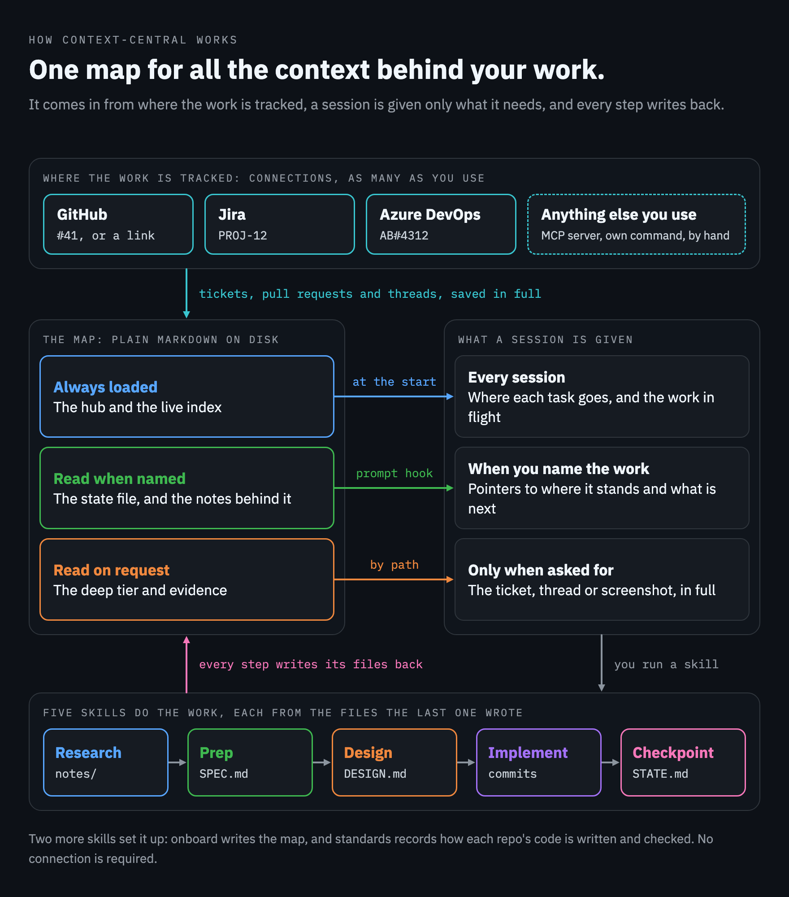

# context-central

A Claude Code plugin that gives all the context behind your work one central place: a map of plain Markdown notes about your repositories and the work in flight.



## What it does

- **Keeps a map.** A folder of plain Markdown notes about your repositories and the work you have in flight.
- **Shows Claude the work in flight.** Every session starts with a short index, one line for each piece of work.
- **Points Claude at the right notes.** Name a piece of work, a pull request or a repository in your prompt, and Claude gets a short list of the notes behind it.
- **Keeps each piece of work in a small state file.** It says where the work stands, what is done and what is next.
- **Saves long text in full.** Tickets, pull requests and threads are kept whole behind the short files, and read only on request.
- **Reaches the work wherever it is tracked.** Tickets, pull requests, meetings and chat are recorded as connections, each reached by its own command-line tool, by an MCP server your session holds, or by hand. None is required.

## How it helps

- **A new session picks up where the last one stopped.** The state file says where the work stands, so you do not explain it again.
- **Context stays small.** Two small things load every time: one file that routes each task, and the index of work in flight. The rest is read when it is named or asked for.
- **Nothing is lost.** Long text is kept in full, and each short note names the full text behind it.
- **It stays quiet.** The hooks say nothing unless a map covers the folder and the match is confident.
- **It is plain files.** The map is Markdown and stays readable without the plugin. There are no runtime dependencies, and the resolver makes no network call.

## The core idea

Load little, and point to the rest. A map has three tiers, and the tier decides when Claude sees a file.

| Tier | What is in it | When Claude sees it |
|---|---|---|
| Always loaded | the hub (where each task goes, and the standing rules) and the live index (the work in flight, one line each) | at the start of every session |
| Read when named | a work item's state file, and the notes behind it | when your prompt names the work |
| Read on request | the deep tier (tickets, pull requests and threads in full) and evidence (screenshots, recordings, exports) | by path, only when asked for |

Two rules keep it honest:

- Every brief names the full-text file behind it.
- Status goes in state files, never in the hub.

## How it works for you

1. **Set it up once.** Install the plugin and run `/context-central:onboard`. It reads what it can from disk, asks what is left, and writes the map.
2. **Start a session.** Claude already has the list of work in flight.
3. **Name the work** in your prompt, by its ticket in any spelling or by its plain name. Claude is pointed at its state file and the notes behind it.
4. **Do the work with the skills.** `/context-central:research` finds out from primary sources, `/context-central:prep` writes the spec, and `/context-central:implement` builds it one slice at a time.
5. **Write it back.** `/context-central:checkpoint` updates the state file, so the next session starts from there.

## Install

It needs:

- Node 22.18 or later
- macOS, Linux (WSL included) or Windows
- on Windows, Git for Windows as well

There are no runtime dependencies. It is written in TypeScript, which Node runs as it is: nothing is compiled or installed.

On Windows it has been tried only on GitHub's Windows machines, not in a live Claude Code session. [Working from a terminal](#working-from-a-terminal) lists what was shown there, and [What it does not do](#what-it-does-not-do) lists what was not.

From a shell:

```sh
claude plugin marketplace add azamkhanuk/context-central
claude plugin install context-central@context-central
```

Or both at once from inside a session (Claude Code v2.1.275 or later):

```
/plugin install context-central --marketplace azamkhanuk/context-central
```

**Trying a local clone.** The repository is its own marketplace. Give `claude plugin marketplace add` the path of the clone. The plugin then loads in place, and edits apply at the next session or `/reload-plugins`.

**Updating.** The plugin carries a version, and an installed copy stays on its release until a newer one is published. `claude plugin update context-central@context-central` fetches it. Auto-update is off by default for a marketplace you add yourself.

**Releases.** [CHANGELOG.md](CHANGELOG.md) says what each release changed, and each one is on the repository's Releases page.

## First run

Start a session in the folder that holds your checkouts and run:

```
/context-central:onboard
```

It then:

1. reads what it can from disk: repositories, instruction files, ticket keys in branch names, tools on `PATH`, and adds the MCP servers the session holds
2. asks only what is left unsettled, in one pass
3. shows the draft settings
4. writes the map
5. proves each connection with one real read, which saves nothing

Restart or `/clear` afterwards so the hub loads.

## How a map is laid out

A map is a folder of Markdown with one settings file, `estate.json`. An estate is the set of repositories you work across, with the folder that holds their checkouts. One estate has one map. [CONTEXT.md](CONTEXT.md) defines the plugin's terms.

There are two layouts:

- **Root**: `estate.json` sits at the estate root, above the checkouts. The map is the root itself.
- **Inner**: `estate.json` sits in `<repo>/.context-central/`. The map lives inside one repository. The hub is that repository's own `CLAUDE.md` at its root, because that is the file Claude Code loads there. `init` adds one marked block to it and leaves the rest as it is.

```
<estate root>/
  estate.json          settings: repos, connections, folders left alone, budgets
  CLAUDE.md            the hub: routing table, standing rules, where the parts are
  glossary.md          the estate's own terms
  repos/ areas/ concepts/ edges/ decisions/ docs/    nodes, one subject per file
  log/2026-01.md       dated one-line notes
  work/<item>/
    STATE.md           where the item stands and what is next
    SPEC.md            what is being built
    notes/             research and working notes
    sources/           full text of tickets, PRs, threads: the deep tier
    evidence/          files that are not text: screenshots, recordings, exports
  bin/context-central   optional launcher for use outside a session, with context-central.cmd beside it
  web/ api/ ...        the checkouts, registered in estate.json
```

- A work item is named by a ticket key (`PROJ-12`) or a plain name (`portal-split`). Its state file can carry its ticket, so a plain name still answers to `#41`.
- Nodes link to each other with wiki links (`[[concepts/gateway]]`) or relative Markdown links.

## The three tiers

What loads, and when, is decided by tier. The budgets are settings under `budgets` in `estate.json`. `context-central lint` reports anything over.

| Tier | Holds | How it reaches the session | Budget (default) |
|---|---|---|---|
| Always loaded | the hub | Claude Code loads it at launch | `hubLines`: 200 lines, imports included |
| Always loaded | the live index: one line per work item in flight | the session-start hook | `indexChars`: 2,000 characters |
| Read when named | a work item's state file | resolver pointer; delivered again after compaction | `stateChars`: 10,000 characters |
| Read when named | nodes and work notes | resolver pointers, at most `resolveMax` (6) after the entry file | `nodeBytes`: 20,000 bytes, a soft cap |
| Deep | everything under `sources/`, and files named `*-full-text.md` | by path only, counted but never listed one by one | none |
| Evidence | every file under a work item's `evidence/` | by path only, counted and never opened | `evidenceBytes`: 1 MB a file, checked only where evidence is committed |

Two more budgets shape what the hooks do:

| Budget | Default | What it sets |
|---|---|---|
| `hookTextChars` | 600 characters | The longest prompt the hook matches on its words |
| `resumeNoticeTokens` | 100,000 tokens | The session size from which the resume notice is shown; 0 turns it off |

### Evidence

Evidence is any file under a work item's `evidence/` folder. The folder is for what was seen and is not text: a screenshot, a recording, an export.

- The commands count every file there, whatever its kind, and never open one.
- A file sits at `work/<item>/evidence/<YYYY-MM-DD>-<what>.<ext>`, lower case with dashes.
- A note names it, by custom `notes/<YYYY-MM-DD>-evidence.md`.
- `context-central evidence add` copies a file into place under such a name.
- Text a session can read stays in the deep tier.
- `evidence.commit` in `estate.json` records whether evidence is committed. It is read as false when absent.
- `graph` reports an evidence file no note names.
- `lint` warns on a file in a work item that is neither Markdown nor under `evidence/`.
- `doctor` says when git and the setting disagree.

## Connections

A connection is a named way the estate reaches one outside system for one kind of thing: tickets, pull requests, meetings, chat or any other. An estate can have any number, and none is required: with no connection every command, hook and skill works as before. One is recommended, so that a session can read the ticket or the pull request behind the work.

They are recorded under `connections` in `estate.json`, by name:

```json
"connections": {
  "tracker": { "holds": "tickets", "references": ["PROJ-\\d+"], "server": "issues" },
  "code": { "holds": "pull-requests", "preset": "<a preset>", "account": "acme-bot" },
  "notes": { "holds": "meetings", "how": "Ask for the minutes in the channel." }
}
```

| Key | What it says |
|---|---|
| `holds` | The kind of thing. `tickets` and `pull-requests` have a part in the skills; any other word is carried as written |
| `references` | Regular expressions for how text names one thing in it. A part named `id` is the thing's own identifier, and a part named `repo` is its repository |
| `preset` | One of the plugin's presets, with that preset's own parameters beside it |
| `server` | The name you gave an MCP server or a connector. The session finds the tool when it needs it, so no tool name is recorded |
| `commands` | Your own command for an action (`read`, `search`, `comment`, `transition`, `open`), as a list of words. A session runs it; the plugin never does |
| `how` | Anything else, in words, for a connection reached by hand |
| `account` | The account its tool must run as. `doctor` checks it and never switches it |
| `repos` | For pull requests: the registered repos it serves, when more than one connection holds them |

**References.** `PROJ-12`, `#41`, `AB#4312` and a link can each name a ticket. A reference is matched whatever its letter case and never inside a longer word. A work item answers to every spelling of its own ticket. That is the `ticket` line in the head of its state file, which `work new <item> --ticket <reference>` writes, or its name when the name is itself a reference.

**Presets.** A preset is what the plugin knows about one vendor's system: how its references look, which program reads from it, and how a checkout's remote reads as it. `context-central connections --presets` lists the ones this version carries. A preset is optional knowledge, kept in one folder of the plugin with a file for each vendor, and nothing else in the plugin names a vendor. A connection with no preset is used in every skill like any other.

**How a connection is read.** `context-central connections` lists each one with how this machine reaches it:

- **by fetch**: its preset has a read command and that program is on the `PATH`, so `fetch` saves the full text with no agent
- **by a session**: through the server named, or with your own command, which the fetcher agent uses
- **by hand**: the skill asks you to paste the text and saves it in full

A developer who has some of an estate's connections and not others is served by those they have. A tool that is missing is a note in `doctor`, never a fault.

**A map made before connections** has no `connections` in its `estate.json` and is read as it always was. Its tracker, its code host and its sources are shown as connections, and a GitHub pull request link and `fetch pr|issue` go on working there whatever it records. To move it over, write `connections` by hand in the shape above. The old `tracker`, `codeHost` and `sources` are then no longer read.

## What the hooks put in context

### At session start

On startup, resume, clear, compaction and fork, the hook adds the live index.

- It names the map, the hub, and each work item in flight with its title and state file.
- Where the map records connections, one line names each, what it holds and the ways recorded for it.
- After compaction or on resume, the state file of the item the session was working on follows the index.
- The whole text is cut at 9,500 characters.

### When a prompt is submitted

The hook adds pointers when the prompt names something the map knows. First match wins:

1. a work item, by any spelling of its ticket or by name, or else by its name written with spaces or its title word for word
2. a link that belongs to a connection: the work item that mentions it, or else the note of the repository it names
3. a registered repository name
4. free text that matches a node on at least two words with a clear score

The pointers are a short list of paths with sizes and a reason each, plus a count of the deep files and of the evidence behind the item. They are facts, never instructions. Each answer is delivered once per session.

When a prompt names a ticket that no work item answers to, the hook adds one line saying so and which connection it reads as. A bare number is never reported, a reference is reported once per session, and three are reported at most.

Two limits:

- A prompt longer than `budgets.hookTextChars` (600 characters) is matched only on work item tickets and names, links and repo names. It is not matched on its words, a title or a name written with spaces, and no ticket without a work item is reported: a pasted log or diff would match those by chance.
- On the command line `resolve` has one more route after free text: when two or more words of the query all sit in the name and title of one work item, and of no other, the answer is that item. The hook never uses it.

### When a large session resumes with an expired cache

The hook shows a notice to the person, not to the model. If Claude Code reports that the prompt cache has likely expired and the session holds at least `budgets.resumeNoticeTokens` (100,000) tokens, the hook shows one line giving the size and saying that a fresh session started from the work item's state file is cheaper.

### When the hooks stay silent

- no map covers the session's folder
- the working directory is inside a different map
- the folder is outside the estate, under a `leftAlone` entry, or not a registered repo or node folder
- the prompt matches nothing with confidence
- the same answer was already delivered in this session

If `estate.json` is invalid, the person sees a one-line message and the model sees nothing. The resolver makes no network call.

## Commands

Inside a session the plugin puts `context-central` on the Bash tool's `PATH`.

Exit codes: 0 fine, 1 a problem was found, 2 wrong usage.

| Command | What it does |
|---|---|
| `config [--get <key>]` | Print the estate settings, or one of them by dotted key |
| `where [--json]` | Show which map covers this folder and whether the hooks answer here |
| `work new\|list\|done\|reopen` | Create a work item with its state file and, with `--ticket`, its ticket; list work in flight; mark an item done or reopen it |
| `resolve <query...> [--max N] [--json] [--absolute]` | List the notes behind a work item, a link, a repo name or free text, and say which ticket named has no work item |
| `index [--absolute] [--json]` | Print the live index of work in flight |
| `hook <session-start\|user-prompt-submit>` | The hook entry point: JSON on stdin, JSON on stdout |
| `graph [--json] [--strict]` | Report broken links, orphan nodes, and deep files and evidence nothing points to |
| `lint [--json] [--strict]` | Check the hub, state files, nodes, evidence and index against their budgets |
| `doctor [--json]` | Check the setup: Node, settings, hub, lint, links, repo folders, git ignore rules, evidence against git, legacy hooks, connections |
| `note <text...>` | Append a dated line to this month's log |
| `note --new <kind>/<name> [--title <title>]` | Create a node from a small template |
| `slice <file> --toc\|--heading\|--lines\|--grep` | Read part of a large file: its headings, one section, a line range, or matches with context |
| `fetch ticket\|pr <reference> --item <item> [--connection <name>] [--repo <repo>]` | Read a ticket or a pull request with the command of its connection's preset, save the full text under the item's `sources/`, then print a digest. `--check` in place of `--item` tries the connection and saves nothing |
| `connections [--json] [--presets]` | List the connections and how this machine reaches each, or the presets this version carries |
| `evidence add <file> --item <item> [--as <what>]` | Copy a file that is not text into the item's `evidence/` under a dated, cleaned name, never overwriting |
| `detect [dir] [--json]` | Report what can be read from disk before asking anyone: repos, instruction files, key patterns, tools, accounts and connection candidates |
| `init [dir] --from <answers.json> [--dry-run]` | Write a new map from an answers file, never overwriting |
| `init --print-settings` | Print the settings that enable the plugin for a map |
| `wrapper [--write]` | Print a launcher for running the CLI from a terminal, or save it in the map with one for cmd |
| `budget [dir] [--json]` | Show what a session started in a folder loads at launch from instruction files |

About `doctor`:

- It prints one line per check: `ok`, `FIX` with what to do, or `note` with something worth knowing. It exits 1 only if something needs fixing.
- Its connections check holds one thing to be a fault: a pinned account that is not the active one. A tool that is not installed, and a map with no connection, are notes.
- Its hooks check looks for hooks from an earlier tool that would resolve the same prompts a second time.
- Name those hooks in `estate.json`, for example `"legacyHooks": ["old-resolver.mjs"]`. The list is empty by default, and the check then passes.
- A hook command that contains one of those strings counts when it is in the estate's own `.claude/settings.json` or `.claude/settings.local.json`, or in your user settings and pointing at this estate's root.

## Skills

Typed with the plugin prefix. The first four run only when you invoke them; `checkpoint` may also be picked up by the model.

| Skill | What it does |
|---|---|
| `/context-central:onboard` | Detects the estate, asks what is unsettled, writes the map, proves each connection, runs `doctor` |
| `/context-central:research <question> [item]` | Researches from primary sources, marks each claim verified or inferred, writes a note |
| `/context-central:prep <item>` | Reads the item's ticket, then turns the conversation and research into the item's `SPEC.md` and a short tracker brief |
| `/context-central:implement <item>` | Builds from the state file and spec, one slice at a time, following the estate's settings for tests and review |
| `/context-central:checkpoint` | Writes the session back: state file, lasting lessons, the session's terms in the glossary, log line, then `lint` and `graph` |

## Agents

| Agent | What it does |
|---|---|
| `context-central:reader` | Reads the paths it is given and returns short findings with `path:line` references. Does not load `CLAUDE.md` |
| `context-central:fetcher` | Fetches one ticket, PR, thread or meeting through the connection it is given, saves the full text to `sources/` first, returns a digest and the path. Only reads from external systems |
| `context-central:reviewer` | Reviews a diff against the spec and the estate's standing rules. Never edits |

## Working from a terminal

Outside a session the CLI is not on your `PATH`, so the map can hold a small launcher.

**Write it once**, in either of two ways:

- from inside a Claude Code session in the map, ask Claude to run `context-central wrapper --write`
- from a terminal in the map, run `node <plugin folder>/bin/context-central wrapper --write`

**What is saved.** Three files go in the map's `bin/` folder, on every system, and a file already there is kept. With a map inside a repository the folder is `.context-central/bin/`.

- `context-central`, the launcher: a `sh` script for macOS, Linux and Git Bash
- `context-central.cmd`, the cmd launcher: the same for cmd and Windows PowerShell
- `.gitattributes`, which keeps the first at LF and the second at CRLF when the map is kept in git, whatever a machine's line-ending setting

**Using it.** Each launcher finds the installed plugin through Claude Code's install record and passes the arguments it is given and the exit code through:

```sh
./bin/context-central work list
./bin/context-central doctor
```

**Worth knowing:**

- When the plugin is enabled from project settings there is no install record. Set `CONTEXT_CENTRAL_CLI` to the path of the plugin's `bin/context-central` file and either launcher uses that.
- With the map's `bin/` folder on your `PATH`, the name `context-central` alone runs the cmd launcher in cmd and Windows PowerShell, and the launcher in Git Bash.
- PowerShell quotes arguments again in its own way before the cmd launcher is given them; what arrives then has not been tried.
- The cmd launcher looks for the install record in `CLAUDE_CONFIG_DIR`, or else in `.claude` under your Windows profile folder.

### On Windows

Windows needs Node 22.18 or later and Git for Windows. A session's Bash tool there is Git Bash, and that is where the skills call `context-central`.

What the checks have shown on GitHub's Windows machines, with Node 22 and 24:

- the commands, run as a process
- both hooks answering when started as the hooks manifest declares them
- a tool found on the `PATH` under a name ending in `.exe` or `.com` and started by its bare name: real `git` for `detect` and `doctor`, and a stand-in named `gh.exe` for `gh`; a tool installed only as a `.cmd` or a `.bat` reads as missing
- the bare command and the launcher, typed in Git Bash, and the launcher found there by its bare name in a folder that also holds the cmd launcher
- the cmd launcher run through cmd, with arguments that hold a space, nothing, `*` and an apostrophe arriving unchanged
- the cmd launcher found by its bare name in cmd and in Windows PowerShell, with two plain arguments and its exit code coming back
- a map whose files have Windows line endings or a byte-order mark: frontmatter and `estate.json` are read, and `work done` changes one line and keeps the rest as it found it

What has not been shown there is under [What it does not do](#what-it-does-not-do).

## Two accounts on one machine

A plugin installed at user scope belongs to one Claude Code config directory. If you switch accounts by config directory, enable the plugin from the map's project settings instead, so whichever account opens the map gets it:

```sh
context-central init --print-settings
```

Put the printed JSON in one of:

- the map's `.claude/settings.json`, shared with everyone who clones the map
- the map's `.claude/settings.local.json`, for this machine only

It declares the marketplace, enables `context-central@context-central`, and allows `Bash(context-central *)`.

The command only prints: `.claude/` is a protected path, so the write is yours to approve. Claude Code applies project settings after you accept the trust prompt for the folder.

## Turning it off

- **In one folder**: add it to `leftAlone` in `estate.json`. The hooks stay silent there.
- **On one machine, for a map that enables it**: set `"context-central@context-central": false` under `enabledPlugins` in the map's `.claude/settings.local.json`.
- **For your account**: `claude plugin disable context-central@context-central`.
- **For good**: `claude plugin uninstall context-central@context-central`.

The map is plain Markdown and stays readable without the plugin.

## What it does not do

- Its own commands never post to a tracker or a code host, and the fetcher only reads. A skill may post through a connection only where your write rules allow it and you approve the exact text.
- Its own `fetch` reads only with the command of a preset. A connection with no preset is read by a session, through its server or your own command. The plugin never runs a command that `estate.json` names.
- Of the presets' read commands, only GitHub's has been run against the real tool. Jira's and Azure DevOps's were written from their vendors' documentation and tried against stand-ins. `fetch --check` shows whether one works for you.
- A pull request read by `fetch` holds what the preset's tool returns. Where that leaves out a review's line comments, the fetcher can read them through a server that offers them.
- On Windows it does not start a tool that is installed only as a `.cmd` or a `.bat` file. `fetch` says so, and a session reads that connection through its own shell or a server.
- It does not link or copy nodes into the checkouts. Nodes are reached by pointer.
- It does not ingest meetings on its own: the fetcher reads one when asked. It ships no workflows and no evals.
- It does not judge whether a note is true. `lint` and `graph` check size and links, nothing more.
- On Windows it has not been tried in a live Claude Code session. These are untested on Windows, not known to fail:
  - Nothing has shown that Claude Code fires the hooks there, or that a skill reaches `context-central` from the Bash tool.
  - Nothing has shown what `fetch` does with an answer from a preset's tool there, or what `doctor` and `detect` make of its accounts.
  - Of `doctor`'s check on what git ignores, one case ran there with real `git`: checkouts the map's repository does not ignore.
  - PowerShell 7 has not been tried, and no argument with a space or a special character has been sent through either PowerShell.
- It does not support a Windows session that has only the PowerShell tool. The skills call `context-central` from the Bash tool, which needs Git for Windows.
- It ships a `bin/` folder, so claude.ai and Cowork do not install it. It is for Claude Code.

## Licence

MIT. See `LICENSE`.
