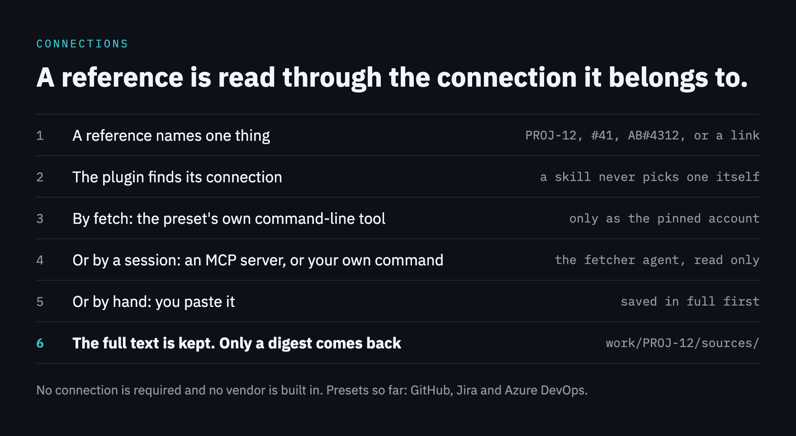

# Connections

A connection is a named way the estate reaches one outside system for one kind of thing: tickets, pull requests, meetings, chat or any other. An estate can have any number, and none is required: with no connection every command, hook and skill works as before. One is recommended, so that a session can read the ticket or the pull request behind the work.



They are recorded under `connections` in `estate.json`, by name:

```json
"connections": {
  "tracker": { "holds": "tickets", "references": ["PROJ-\\d+"], "server": "issues" },
  "code": { "holds": "pull-requests", "preset": "<a preset>", "account": "acme-bot" },
  "notes": { "holds": "meetings", "how": "Ask for the minutes in the channel." }
}
```

| Key | What it says |
|---|---|
| `holds` | The kind of thing. `tickets` and `pull-requests` have a part in the skills; any other word is carried as written |
| `references` | Regular expressions for how text names one thing in it. A part named `id` is the thing's own identifier, and a part named `repo` is its repository |
| `preset` | One of the plugin's presets, with that preset's own parameters beside it |
| `server` | The name you gave an MCP server or a connector. The session finds the tool when it needs it, so no tool name is recorded |
| `commands` | Your own command for an action (`read`, `search`, `comment`, `transition`, `open`), as a list of words. A session runs it; the plugin never does |
| `how` | Anything else, in words, for a connection reached by hand |
| `account` | The account its tool must run as. `fetch` reads only as it, `doctor` says whether it can, and neither switches the account that is active on the machine |
| `repos` | For pull requests: the registered repos it serves, when more than one connection holds them |

**References.** `PROJ-12`, `#41`, `AB#4312` and a link can each name a ticket. A reference is matched whatever its letter case and never inside a longer word. A work item answers to every spelling of its own ticket. That is the `ticket` line in the head of its state file, which `work new <item> --ticket "<reference>"` writes, or its name when the name is itself a reference. In a shell a reference goes in quotes, since `#` starts a comment there.

**Presets.** A preset is what the plugin knows about one vendor's system: how its references look, which program reads from it, and how a checkout's remote reads as it. `context-central connections --presets` lists the ones this version carries, each with the parameters it takes, which are written beside `preset` in the connection's entry. A preset is handed those parameters and nothing else of the entry. A preset is optional knowledge, kept in one folder of the plugin with a file for each vendor, and nothing else in the plugin names a vendor. A connection with no preset is used in every skill like any other.

**How a connection is read.** `context-central connections` lists each one with how this machine reaches it:

- **by fetch**: its preset has a read command and that program is on the `PATH`, so `fetch` saves the full text with no agent
- **by a session**: through the server named, or with your own command, which the fetcher agent uses
- **by hand**: the skill asks you to paste the text and saves it in full

`context-central connections --ticket "<reference>"` lists only the connection that ticket belongs to, `--pr "<reference>"` the one a pull request belongs to, and `--item <item>` the one a work item's own ticket belongs to. It is the connection `fetch ticket` and `fetch pr` read through: the one whose references claim it or, where none does, the only connection that holds the kind. Where two claim a link, the one that names its repository under `repos` has it, then one that names no repos, and otherwise the one written first. A link's repository is matched to a registered repo by its name. A reference that names no repository belongs to the first written of those that claim it. On a map made before connections the answer can be a preset that applies unasked, and its line says that the map does not record it. A skill never picks a connection for itself: it reads through `fetch`, which finds the connection or names it and says how a session reads it, and it asks this before it posts on a ticket.

**A pinned account.** Where a connection names an `account`, `fetch` reads only as that account. Where its preset's tool can hand out one account's token, `fetch` asks for the pinned account's and gives it to the tool it starts, in that tool's environment and nowhere else, whichever account is active. Where the tool hands out none, the read goes ahead only if the tool already runs as that account on the connection's own host. Otherwise `fetch` reads nothing, saves nothing and exits 1. `doctor` answers for each pinned connection:

- `ok`: the tool runs as the pinned account
- `note`: another account is active and the tool holds the pinned one. `fetch` reads as it, and the note says how to run one command of your own as it
- `FIX`: the tool cannot run as it here. The line says how to sign the account in, that signing in makes it the active one, and how to put the former one back

No advice from the plugin tells you to change the machine's active account for good. On a map shared with people who have not signed the pinned account in, a read that once went ahead as whoever was active now stops, and `doctor` shows that `FIX`.

A developer who has some of an estate's connections and not others is served by those they have. A tool that is missing is a note in `doctor`, never a fault.

**A map made before connections** has no `connections` in its `estate.json` and is read as it always was. Its tracker, its code host and its sources are shown as connections, and a GitHub pull request link and `fetch pr|issue` go on working there whatever it records. To move it over, write `connections` by hand in the shape above. The old `tracker`, `codeHost` and `sources` are then no longer read.
