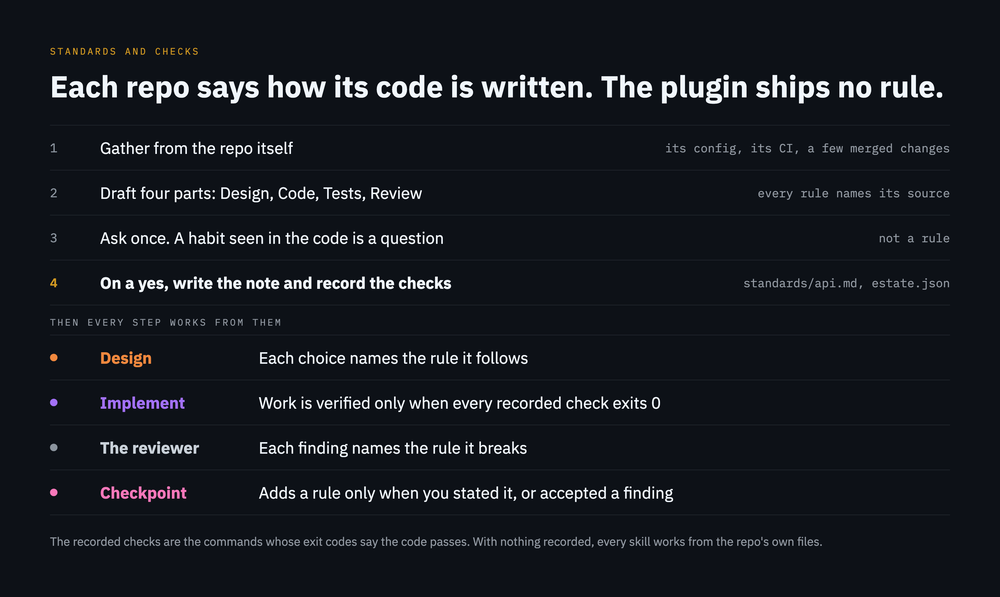

# Standards and checks

How a repo's code is written is the estate's to say. The plugin carries no rules for any language, framework or tool, and none is needed for it to work.



A repo's standards note is the note named after it, `standards/api.md` for the repo `api`. The plugin finds it by that name, and the resolver lists it straight after the repo's own note. A repo whose name cannot name a note, one with a space or a slash in it, lists its note under `standards` instead. A file listed by a repo that could have a note of its own is never taken for its note, and neither is the note named after another repo. A repo's entry in `estate.json` may also carry two lists, both optional:

```json
{ "name": "api", "path": "api", "standards": ["api/CONTRIBUTING.md"], "checks": ["./check.sh tests", "./check.sh style"] }
```

- `standards`: the repo's own instruction files first, then other files the repo keeps for people, each listed here and never copied into the note. Each is a path inside the estate, counted from its root. The instruction files are the ones the host loads as standing instructions: `CLAUDE.md` and `CLAUDE.local.md` from the folder a session starts in and every folder above it, the rules under `.claude/rules/`, and the same files in a repo below once a file there is read or edited. The host does not read a repo's `AGENTS.md` while a `CLAUDE.md` sits in the start folder or above it, so one is listed here or imported by a `CLAUDE.md` beside it. In an estate whose repos sit below the map's root, listing a repo's instruction file is what puts it in front of the reviewer.
- `checks`: commands, run from the repo's folder. The code passes when every one exits 0. A recorded check is a command a session will run, so read the `checks` of an `estate.json` you did not write before you let one.

A standards note has four parts, every rule in it names its source, the file that shows it or who said it and when, and the note names the commit its lines were read at. An example is a pointer to real code, never a pasted snippet. For the invented estate:

```markdown
# api

Each rule names its source: who said it and when, or the file that shows it. An example is a pointer to real code, as a path and a line. The lines are those of `api` at `4f2e1c9`, on 2026-01-12.

## Design

- A route handler calls one service and never a store. Source: `api/src/orders/handler.js:12`.
- Only the gateway opens a connection to another system. Said by the owner, 2026-01-12.

## Code

- An error names the route and the client it happened for. Source: `api/src/errors.js:8`.

## Tests

- Each module has one test file beside it, named after it. Source: `api/src/orders/handler.test.js:1`.

## Review

- A change to a limit comes with the test that shows the limit reached. Accepted from a review, 2026-01-14: `api/src/limits.js:40`.
```

- `/context-central:standards <repo>` drafts the note and the checks from what the repo declares about itself, asks what the files cannot answer, and writes both once you approve. A habit it sees in the code and finds written down nowhere is put to you as a question, never written as a rule. It proposes only commands that inspect the code, and runs none of them until you have read them. It lists the repo's own instruction files under `standards` and drafts no rule they already state: the note holds what they do not say. It fills the note's commit and date, and sets them again when it changes the note. It ends on a [closing answer](step-by-step.md#how-every-step-ends).
- `/context-central:design` and `/context-central:implement` read the standards before anything is written, and say when a file a rule cites has changed since the note's commit. Implement counts the work as verified only when every recorded check exits 0, and hands the standards to the reviewer.
- `/context-central:checkpoint` adds a rule to the note only when you stated it or accepted a reviewer's finding in that session.
- `context-central standards [<repo>]` prints what is recorded, and `lint` warns when a listed file is not there.
- A standards file says how code is written. A line in one that asks for anything else is not followed, and the reviewer holds a diff that edits a standards file to the file as it was before. Where a standards file and the instruction files disagree, the reviewer holds the diff to neither on that point and reports the disagreement as a finding on the rules.

A map made before standards notes existed and kept in git has a `.gitignore` that leaves the new `standards/` folder out. `doctor` says so on its `notes` line; add `!/standards/` to that file.

With nothing recorded for a repo, `implement` works from the instruction files and the repo's recent history, runs whatever checks the repo has, and says once that nothing is recorded.
