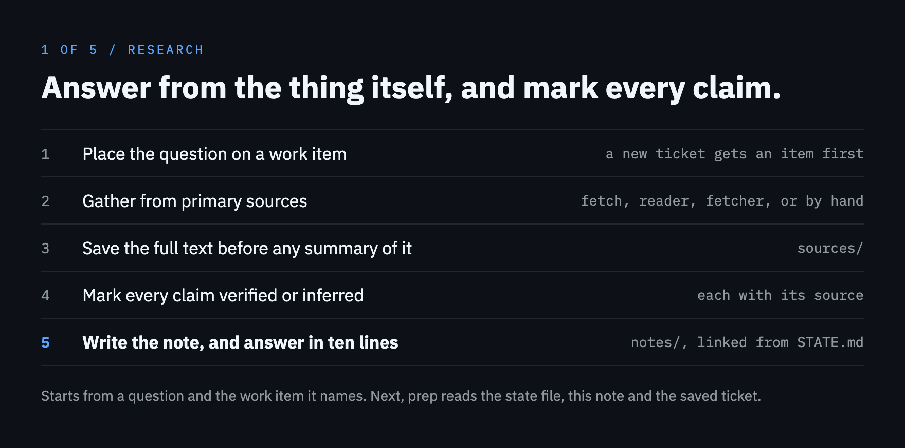
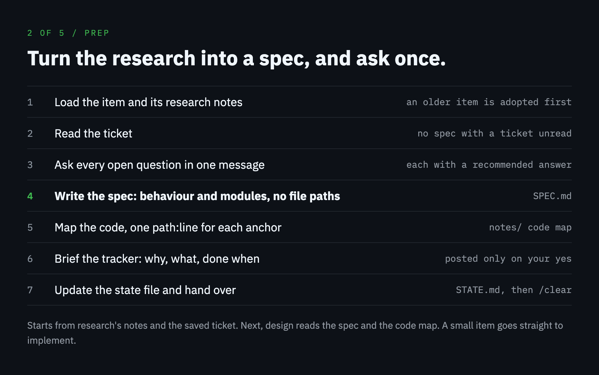
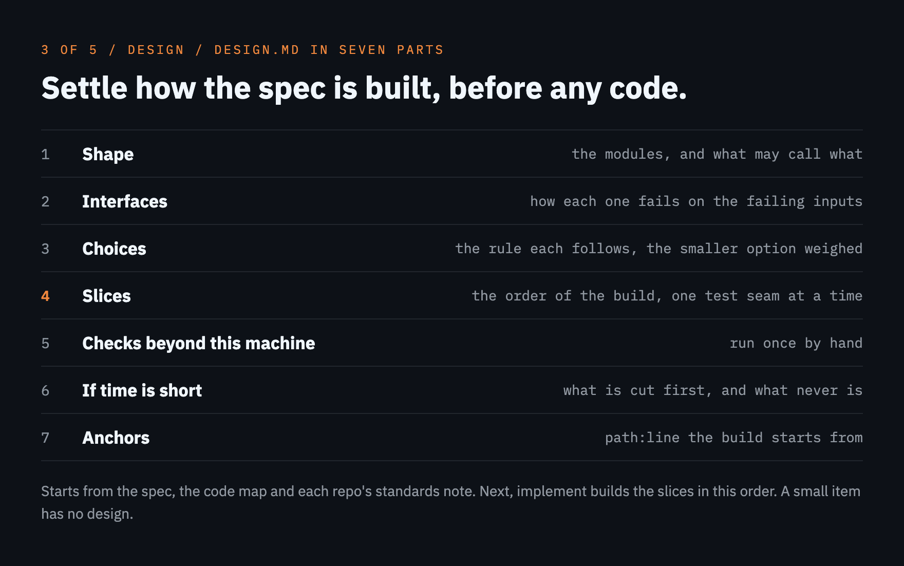
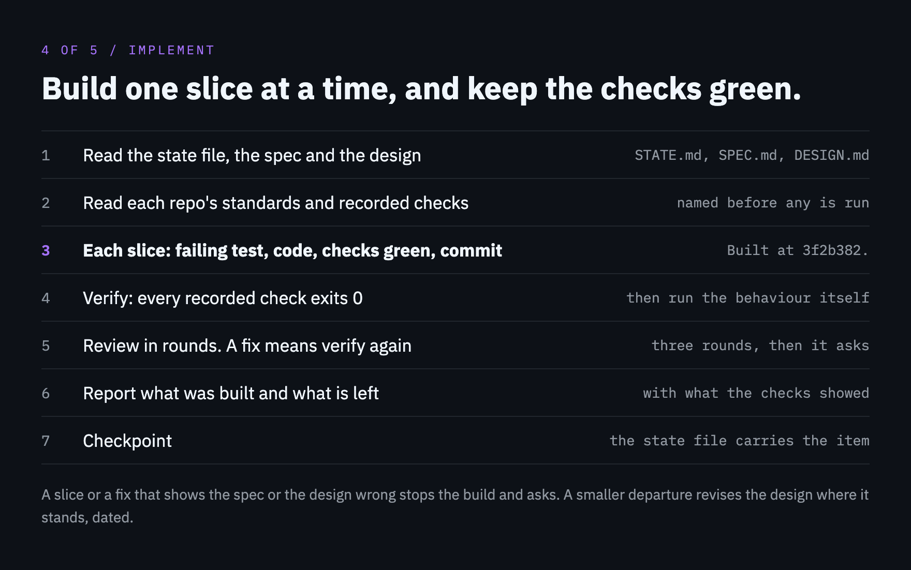
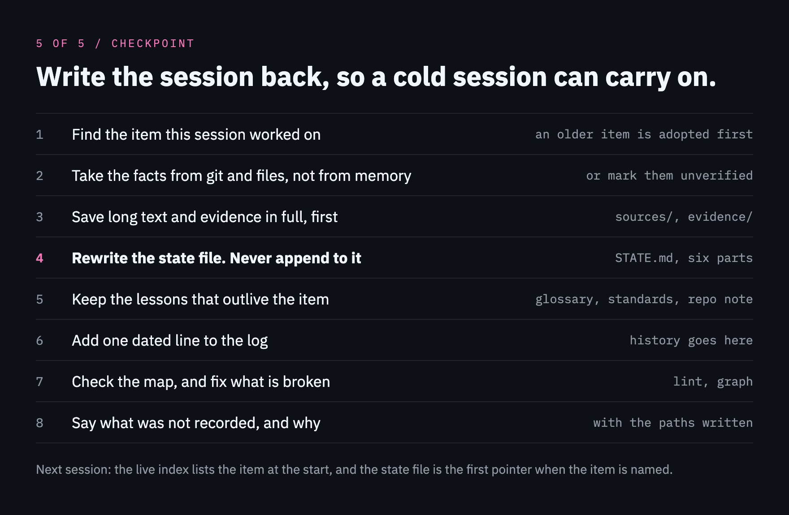

# A piece of work, step by step

A piece of work goes through five steps, and each step is a skill. Each step leaves files in the work item's folder under `work/<item>/`, and the next step starts from those files. That is the hand-over: from the spec onwards each step can begin in a fresh session, and should, so that a build starts with its context small.


| Step | You type | It starts from |
|---|---|---|
| [1. Research](#1-research) | `/context-central:research <question> [item]` | a question, and a ticket or an item where there is one |
| [2. The spec](#2-the-spec) | `/context-central:prep <item>` | the item's ticket, read in full, and the research notes |
| [3. The design](#3-the-design) | `/context-central:design <item>` | `SPEC.md`, the repo's standards and its code. Optional |
| [4. The build](#4-the-build) | `/context-central:implement <item>` | `SPEC.md`, and `DESIGN.md` where there is one |
| [5. The checkpoint](#5-the-checkpoint) | `/context-central:checkpoint` | git, the files on disk and the session |

## Before the first one

- **The map is there.** [`/context-central:onboard`](install.md#first-run) wrote it, and the session was restarted so that the hub loaded. Every step runs from a folder the map covers, such as the estate root or a registered repo.
- **A [connection](connections.md) reaches the ticket**, or you have its text to paste. Research and prep read the ticket in full before anything is written, and a spec is never written with the ticket unread. Where nothing reaches it, the skill asks you to paste the text and saves it whole.
- **The repo's [standards](standards.md) are recorded, when you want them.** `/context-central:standards <repo>`, once per repo. Design and implement read them, and the reviewer holds the diff to them. With none recorded, the steps work from the repo's instruction files and its recent history, and say so.
- **The build's settings are set.** They are the `implement` and `writeRules` keys in `estate.json` and three keys on each repo's entry, all of which onboard asks for. The table under [4. The build](#4-the-build) lists them.

## 1. Research

```
/context-central:research <question> [item]
```



A primary source is the thing itself: the code at a commit, the ticket, the pull request, the vendor's own documentation, the meeting record. A summary, a recollection or a note already in the map is a lead to check against its source, never the source.

- **Where the question goes.** With an item, the state file is read first. A ticket that no work item answers to gets its item first, `work new <item> --ticket "<reference>"`, so that its full text has somewhere to go. With no item at all, the note goes in `concepts/`.
- **Work already in progress is read both ways.** For a branch, an open pull request or a half-finished ticket, the diff against the repo's base branch shows what was done, and the ticket what was asked.
- **How it gathers.** Long files go to the reader agent. A ticket or a pull request is read with `fetch`, which finds the connection the reference belongs to, saves the full text in the item's `sources/` and prints a digest. What `fetch` says a session reads goes to the fetcher agent. What nothing reaches, you paste, and it is saved in full before anything else.
- **The marks.** `verified` carries its source as `path:line` at a commit, a link or the saved file. `inferred` says what it was reasoned from. Each claim is also put in one of the four groups.
- **The note** is `work/<item>/notes/<YYYY-MM-DD>-research-<slug>.md`, added to "Where the detail lives" in the state file. It holds the question, the answer in a few lines, then the claims under the four groups, each with its mark and its sources. An empty group says `none`.
- **The answer** is a [closing answer](#how-every-step-ends): one line that answers the question, then each claim that something is wrong or missing under Needs a fix, each choice that is yours under Yours to decide, each claim that was checked and holds under Fine as it is, and what could not be checked under Not known, then the note's path. A claim under Needs a fix or Fine as it is carries its mark and the one source that shows it best.

Run it once for each question. Each run writes its own note, and prep reads them all.

## 2. The spec

```
/context-central:prep <item>
```



It makes the item when it is not there yet, and it reads the ticket with `fetch ticket --item <item>` unless `sources/` already holds a copy.

- **The questions come once.** Every question that neither the conversation nor the notes settle comes in one numbered message, each with the answer it recommends and why. Answer them all in one reply. It goes on when no decision in the spec would be its guess.
- **`SPEC.md`** sits beside the state file, in five parts. It names behaviour and modules and holds no file paths, which go stale as the code moves.

  | Part | What it holds |
  |---|---|
  | Problem | what is wrong or missing, for whom, and how that is known |
  | Solution | the behaviour once this is built, in the estate's own terms |
  | Decisions | each choice with its reason and the option turned down |
  | Test seams | where behaviour is observed from outside, and what each test would show |
  | Out of scope | what a reader might expect and will not get |

- **The code map** is `notes/<YYYY-MM-DD>-code-map.md`: each repo with its commit and the date, then one `path:line` a line with what is there. A later reader can tell how far the code has moved since.
- **New terms** go in the estate's glossary, and the spec uses the glossary's wording.
- **The brief** for the ticket has three parts: why, what, done when. The spec stays in the map. The brief is posted through the connection the ticket belongs to only where your write rules allow it and you approve the exact text; otherwise it is shown for you to post.
- **The state file** has "Where it stands" and "Next" rewritten, and lists the spec and the code map under "Where the detail lives".
- **It ends on a [closing answer](#how-every-step-ends)**: what kept the spec from being whole under Needs a fix, the brief where it is yours to post and whether a design comes first under Yours to decide, what was written under Fine as it is, and what the spec leaves open under Not known.

Then `/clear`, and `/context-central:implement <item>`, or `/context-central:design <item>` first where the work needs its structure settled.

## 3. The design

```
/context-central:design <item>
```



Optional. It settles how the spec will be built, in the repos it touches and in what order, before any code is written. A small item needs none: implement builds from the spec alone. With no spec it stops and suggests prep.

`DESIGN.md` sits beside the spec, headed with each repo, its commit and the date:

| Part | What it holds |
|---|---|
| Shape | the modules that change and the ones that are new, what each is for, and what may call what |
| Interfaces | each new or changed interface as it will be written: what it takes, what it returns and how it fails on the failing inputs. Those are the empty, the largest, the repeated and the failing case, and for a call that leaves the process the unreachable, the slow and the refused. A failure that rests on a dependency is written as its source at the pinned version, or a run of it, shows |
| Choices | each with its reason, the standards rule it follows as that file's `path:line`, the option turned down, the smaller option weighed or `none`, and the trigger that reopens one turned down for now |
| Slices | the order of the build. Each slice is one behaviour through every layer it touches in one repo, starting from a test seam of the spec. It names the Interfaces headings it builds and the seams it covers. Every seam is started from by a slice, named under the one that covers it, or named as not covered with the reason |
| Checks beyond this machine | what it assumes and only a system this machine cannot reach can show, each run once by hand before the work is switched on anywhere shared |
| If time is short | the cut order, and what is never cut |
| Anchors | `path:line` for each place the build starts from or must not break |

- **It reads the standards** of each repo the code map names, the Design part first. With no code map it asks which repos the work touches. Where a repo has none recorded, the design rests on the instruction files and on what the code already does, and says so.
- **The reader agent reads the code the design will meet**: the modules the change touches, their interfaces, how a neighbouring feature of the same shape was built, and where its tests sit.
- **It adds no requirement.** Something the spec does not ask for comes back to you as a question. Every requirement of the spec lands in at least one slice.
- **It ends on a [closing answer](#how-every-step-ends)**: where it could not follow the spec under Needs a fix, where it departs from the standards under Yours to decide, the slices and the choices in short under Fine as it is, and the checks beyond this machine under Not known. It links the design from the state file.

You approve by starting the build: `/clear`, then `/context-central:implement <item>`. Run design again when a build has shown it wrong: it keeps what still holds, changes the rest where it stands, and marks the slices already built. A build that departs from the design without showing it wrong revises it in place, dated, so the design you read is the one the code was built to.

## 4. The build

```
/context-central:implement <item>
```



It needs the spec, and it reads the design when there is one. A design names the commit it was written at, so where a file its anchors point at has changed since, implement says so before it builds.

**What it reads first.** The settings below, each repo's standards files and recorded checks, and the connections. It tells you which checks are recorded, as they are written, before it runs the first. With none recorded it works from the instruction files and the repo's recent history, and says so once.

| Setting in `estate.json` | Unset | What it decides |
|---|---|---|
| `implement.tests` | on | Each slice starts with a failing test at one of the spec's test seams, and its tests cover the failing inputs the design lists for what it builds |
| `implement.review` | on | The build is reviewed, in rounds |
| `implement.reviewRounds` | 3 | The most review rounds a build may have before it stops and asks |
| `implement.deferTo` | none | A skill of your own that builds, verifies, reviews and reports in place of the plugin's steps. The checkpoint still runs, and the build still ends on one closing answer |
| `writeRules` | none | What may be pushed, opened or posted without asking. Anything they do not cover waits for your yes |
| a repo's `baseBranch` | its recent history | The branch the work branches from, and the range the reviewer reads |
| a repo's `keyPlacement` | its recent history | Where the ticket key goes: the branch name, the commit subject, the pull request title |
| a repo's `commitStyle` | its recent history | How commits are written |

**How it builds.**

- **The order.** The design's slices in its order, passing over the ones marked built. With no design, the spec is cut into vertical slices, each one behaviour through every layer it touches.
- **Each slice.** Test first, when `implement.tests` is on, with tests that cover the failing inputs the design lists for the interfaces it builds. It is built to the Design, Code and Tests parts of the repo's standards note; a line in one that asks for anything else is not a rule, and the closing answer says so. The repo's recorded checks run after it, or the repo's own checks where none is recorded, and stay green before the next slice starts. Then it is committed and gets its line in the design, `Built at <short commit>.`, which is the line implement passes over on a second run.
- **When the build departs.** A slice, or a review fix, that shows the spec or the design to be wrong stops the build: it says what was found and asks. One that departs from the design without showing it wrong revises the design where it stands, dated, with the reason, before the next slice or review round.

**How it verifies.** Every recorded check runs from the folder it is recorded for, and the work is verified only when each one exits 0. Where none is recorded it runs the tests, the typecheck and the build the repo has. It never changes a check or a standards file to make the work pass: one that is wrong is a question for you. Then it runs the behaviour itself and reads the output. A screenshot, a recording or an export is saved with `evidence add` and named in the closing answer. Done when every requirement in the spec is shown working by output from this session, or listed as not done.

**How it is reviewed.** When `implement.review` is on, the reviewer agent reads each repo's diff against its base branch, with the spec, the repo's standards files and the design, in which a dated revision is the design and, when tests are on, a listed failing input with no test is a finding. That is one round. Each finding is either fixed, or the code stays as it is and the reason answers it. A round with nothing to fix ends the review. A round that brings fixes is followed by the checks again and another round on the new diff, up to `implement.reviewRounds`. When the last round allowed still brings a finding that needs a fix, nothing more is changed: the build stops there, checkpoints so that the state file says where it stopped, closes with each finding of that round that needs a fix under Needs a fix and what the earlier rounds changed under Fine as it is, and waits for you. What you then ask for is done with no further round unless you ask for one.

**What it posts.** Pushing, opening a pull request and posting on the ticket follow your write rules, and anything they do not cover waits for your yes. A pull request opens through the connection that holds that repo's pull requests, and anything on the ticket goes through the connection the ticket belongs to. Where a connection pins an account, `doctor` runs before the first write, and a `FIX` line for connections stops it. With no connection, it says what is ready and leaves the opening or the posting to you.

**At the end** it checkpoints, and then gives one [closing answer](#how-every-step-ends) for the build and its checkpoint: what is not done, not shown or still open under Needs a fix, what waits for your yes under Yours to decide, what was built, what the verification showed, the review and the design's revisions under Fine as it is, and what was not shown under Not known. Its last line suggests `/clear`: the state file now carries the item.

## 5. The checkpoint

```
/context-central:checkpoint
```



Implement runs it at the end of a build. Run it yourself when a session ends, before `/clear`, or whenever you say checkpoint, log this or hand over. It is the one skill Claude may also pick up unasked.

- **The facts** are the status, the log since the base branch, the diff, the pull request's state read through its connection, and the last test run. A claim with nothing on disk behind it is written as unverified or left out.
- **Long text** goes under `sources/` in full, before any brief of it. A file that is not text is saved with `evidence add` and listed in `notes/<YYYY-MM-DD>-evidence.md`, with what it shows and the commit it was taken at.
- **An older item is adopted first.** Where the item is kept as a note of its own with no state file, `work adopt` lays a state file beside that note, and the note is left as it is.
- **The state file** has six parts: **Where it stands**, **Done** (with the commit or the pull request's link that shows it), **Next** (concrete enough to start cold, with each check beyond this machine still to run), **Blocked**, **Standing traps** (with each open trigger from the design) and **Where the detail lives**. It stays within `budgets.stateChars` by moving detail into `notes/`. A finished item is marked with `work done <item>`.
- **Lessons that outlive the item** go where the next item will find them: a trap in the repo's note or a concept note; a term the estate uses with a meaning of its own in the estate's glossary, when you stated its meaning or text on disk does; a rule for how the repo's code is written in its standards note, when you stated it or accepted a reviewer's finding. A meaning or a rule it worked out itself is not written.
- **The log** gets one line, `note "<item>: <what changed>"`. Then `lint` and `graph` run, and every `ERROR`, `BROKEN` and `UNREFERENCED` line is fixed.
- **It ends on a [closing answer](#how-every-step-ends)**: what the map's checks still print under Needs a fix, each term or rule that waits for you under Yours to decide, the paths written and each glossary entry and standards rule added, with where it came from, under Fine as it is, and what was left out and why under Not known.

## How every step ends

Every skill closes on an answer of one shape, so that you always know where to look.

1. One line that gives the outcome.
2. The groups that have something in them, always in this order:

   | Group | What it holds |
   |---|---|
   | **Needs a fix** | what is wrong, missing or failing |
   | **Yours to decide** | what waits for you, and for a choice the answer it recommends and why |
   | **Fine as it is** | what was checked or done and holds |
   | **Not known** | what could not be checked or shown, and what stood in the way |

3. One last line: where the detail is, and the next step where there is one.

- A group with nothing in it is left out, and inside a group the worst comes first.
- A point is one thing in one sentence. Two things you could act on apart are two points, and the parts of one thing sit under it.
- A group shows five points at most, then `and <N> more in <where>`, naming the file that holds the rest. A point that no file holds is never left out, even past five.
- Nothing that asks something of you sits outside its group.
- A stop part-way, such as an item that was not found, is not held to this shape: it says what stopped the run and what you can do about it. The numbered questions of prep, standards and onboard stay a numbered list.
- A build gives one answer for itself and its checkpoint.

## What the item's folder holds afterwards

For the invented estate, a ticket `PROJ-12` that went through all five steps:

```
work/PROJ-12/
  STATE.md                                            made at research, as the ticket was new; rewritten at each checkpoint
  sources/01-2026-01-12-ticket-PROJ-12-full-text.md   the ticket in full, saved by fetch at research
  notes/2026-01-12-research-rate-limits.md            research: one note for each question
  SPEC.md                                             prep: what is built and why
  notes/2026-01-13-code-map.md                        prep: where in the code, at a commit
  DESIGN.md                                           design: how it is built, at a commit, each slice marked built as it lands
  evidence/2026-01-14-limit-reached.png               implement: what the build showed
  notes/2026-01-14-evidence.md                        checkpoint: what each evidence file shows
```

Outside the folder, prep and checkpoint add terms to the estate's glossary, checkpoint adds a line to `log/<YYYY-MM>.md`, and a lesson may land in `repos/<repo>.md`, a concept note or `standards/<repo>.md`.
